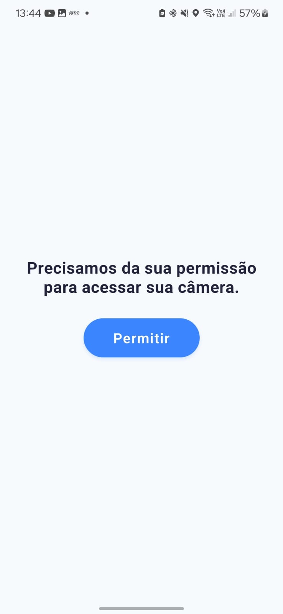
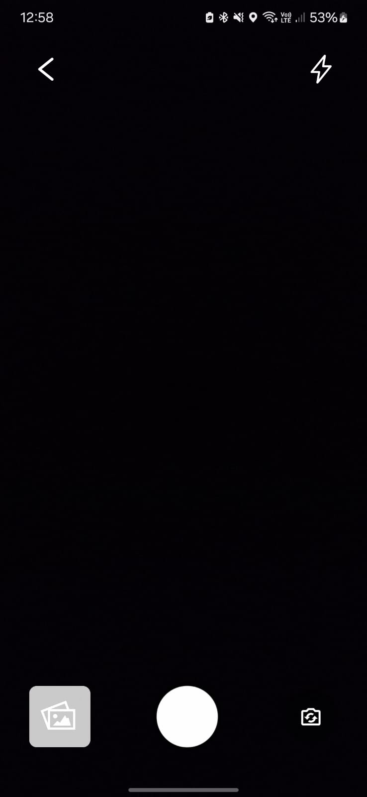
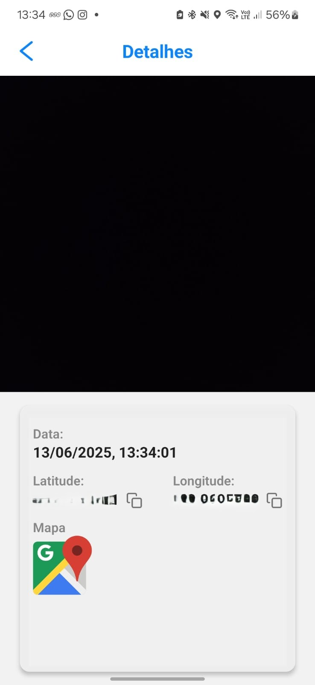
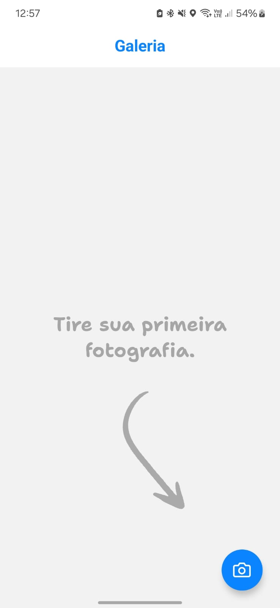
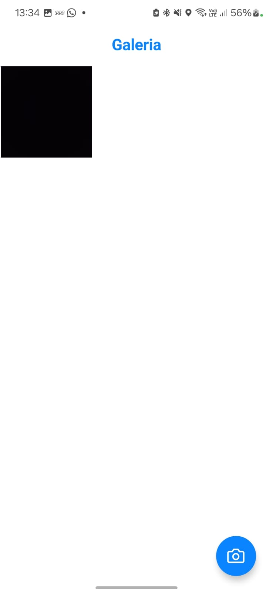

---

# 📸 Camera App com Geolocalização e Timestamp

Este é um aplicativo desenvolvido com **React Native** e **Expo**, que permite a **captura de fotos com localização (GPS) e timestamp**. As imagens são armazenadas localmente e o app conta com diversos recursos para melhorar a navegação e a usabilidade.

---

## ✨ Funcionalidades

* 📷 **Captura de fotos** com:

  * 📍 Coordenadas de **localização** (latitude e longitude)
  * 🕓 Registro da **data e hora** exata da captura
* 💡 **Flash** com opção de ativar/desativar e suporte a:

  * 🔦Simulação de **flash frontal** via sobreposição branca na tela (efeito de iluminação)
* 🔄 Alternância entre câmera **frontal** e **traseira**
* 🗺️ Link direto para abrir a localização no **Google Maps**
* 📌 Botão para **copiar as coordenadas**
* 🧭 Solicitação automática de **permissão de localização**
* ✅ Solicitação de **permissão da câmera** com tela de autorização
* 🖼️ Exibição da **última foto capturada** como miniatura
* 📂 **Armazenamento local** com persistência usando `expo-file-system`
* 🔍 Navegação entre fotos com **scroll horizontal** na tela de detalhes

---

## 📱 Imagens do App

### 📷 Câmera

<p align="center">
   
   
</p>

### 🔎 Detalhes da Foto

<p align="center">
   
</p>

### 🖼️ Galeria
<p align="center">
   
   
</p>

---

## 🚀 Como executar o projeto

Este projeto utiliza **EAS (Expo Application Services)** para build e testes.

### ✅ Requisitos

* **Node.js** (>= 18)
* **Expo CLI** (>= 3.13.0)
* **EAS CLI** (`npm install -g eas-cli`)
* Conta na [Expo.dev](https://expo.dev/)
* Emulador Android ou dispositivo físico com permissões

### ⚙️ Instalação

Clone o repositório:

```
git clone https://github.com/mvss01/galeria-hinova.git
cd galeria-hinova
```

Instale as dependências:

```
npm install
```

Configure o EAS:

```
eas login
eas build:configure --platform android
````

Realize um build para Android:

```
eas build --profile development --platform android
```
Instale a build em seu smartphone lendo o qrcode no console.

Execute o projeto:
```
npx expo start
```
---

## 🔐 Permissões Utilizadas

Este app solicita as seguintes permissões nativas:

* **CAMERA** – Captura de imagens
* **LOCATION** – Localização durante o uso do app

> As permissões são solicitadas em tempo de execução, com fallback para telas de alerta caso o usuário negue.

---

## 🛠️ Observações Técnicas

* A **localização GPS** é gerenciada via **Context API**, garantindo que os dados de latitude e longitude estejam atualizados globalmente.
  O contexto (`LocationContext`) é alimentado por um *observer* (`watchPositionAsync`) com alta precisão e intervalo de 5 segundos. Assim, qualquer componente que utilize o hook `useLocation()` tem acesso à posição atual.

* O armazenamento das imagens é feito localmente no sandbox do app com `expo-file-system`, preservando os dados mesmo após reinicialização.

* A tela de **galeria** permite navegar horizontalmente entre as fotos capturadas, exibindo:

  * Timestamp detalhado
  * Coordenadas GPS
  * Botões para copiar localização ou abrir diretamente no Google Maps

* A tela da câmera exibe em tempo real a última foto tirada no canto da tela e conta com controles intuitivos para flash e troca de câmera.

---
